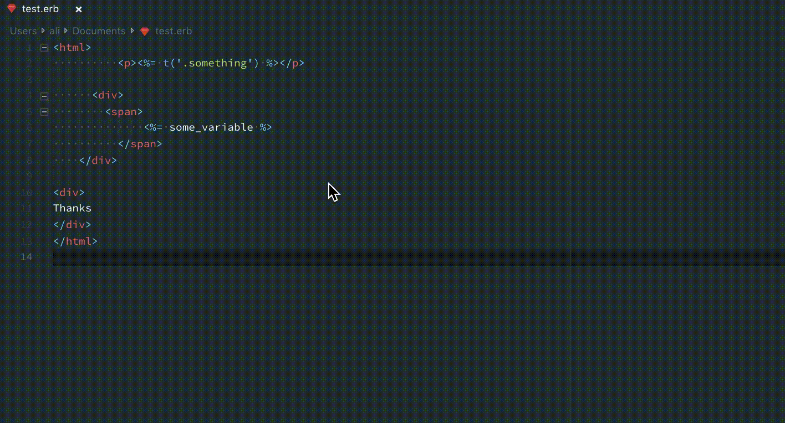

# ERB Formatter/Beautify

[](https://github.com/aliariff/vscode-erb-beautify/actions/workflows/test.yaml)
&nbsp;
[](https://github.com/aliariff/vscode-erb-beautify/actions/workflows/release.yaml)

## Overview

The **ERB Formatter/Beautify** extension for Visual Studio Code uses the [htmlbeautifier](https://github.com/threedaymonk/htmlbeautifier) gem to format ERB files, providing a seamless experience with the VS Code Formatter API. Unlike other solutions that require setting up tasks or manual formatting, this extension integrates directly with VS Code to format your ERB files automatically.

## Features

- Formats ERB files using `htmlbeautifier`.
- Works with the VS Code Formatter API for a native experience.
- Supports custom configuration options for indentation, blank lines, and error handling.
- Ability to ignore specific files or patterns.



## Installation

### Requirements

To use this extension, you must have `htmlbeautifier` installed on your system. You can install it globally or add it to your project's Gemfile.

#### Install Globally

```bash
gem install htmlbeautifier
```

#### Install with Bundler

Add the following to your `Gemfile`:

```ruby
gem 'htmlbeautifier'
```

Then run:

```bash
bundle install
```

## Configuration

### Resolving File Recognition Issues

If `.html.erb` files are recognized as HTML instead of ERB, add the following to your `settings.json` to associate `.html.erb` files with the ERB language:

```json
"files.associations": {
  "*.html.erb": "erb"
}
```

### Setting Default Formatter and Enabling Format-on-Save

To set the default formatter for ERB files and enable format-on-save, add the following to your `settings.json`:

```json
"[erb]": {
  "editor.defaultFormatter": "aliariff.vscode-erb-beautify",
  "editor.formatOnSave": true
}
```

This ensures that the extension formats ERB files automatically whenever they are saved.

### Disabling Formatting for Specific Files

To disable formatting for specific ERB files, such as email templates, use the `ignoreFormatFilePatterns` setting. Add the following to your `settings.json`:

```json
"vscode-erb-beautify.ignoreFormatFilePatterns": ["**/email_templates/**/*.erb"]
```

This configuration ignores all `.erb` files inside the `email_templates` directory.

### Fixing Encoding Issues

If you encounter the "Invalid byte sequence in US-ASCII" error, add the following setting to your `settings.json` to set the correct locale:

```json
"vscode-erb-beautify.customEnvVar": {
  "LC_ALL": "en_US.UTF-8"
}
```

For more details, see the [related issue](https://github.com/aliariff/vscode-erb-beautify/issues/47).

## Settings

Below is a list of settings you can configure in your `settings.json` file:

| Setting                                        | Description                                                                                                                         | Default          |
| ---------------------------------------------- | ----------------------------------------------------------------------------------------------------------------------------------- | ---------------- |
| `vscode-erb-beautify.executePath`              | Path to the `htmlbeautifier` executable. Set this to an absolute path if `htmlbeautifier` is installed in a non-standard location.  | `htmlbeautifier` |
| `vscode-erb-beautify.useBundler`               | Execute `htmlbeautifier` using Bundler (e.g., `bundle exec htmlbeautifier`). If true, `vscode-erb-beautify.executePath` is ignored. | `false`          |
| `vscode-erb-beautify.bundlerPath`              | Path to the Bundler executable. Set this to an absolute path if Bundler is installed in a non-standard location.                    | `bundle`         |
| `vscode-erb-beautify.tabStops`                 | Number of spaces per indent.                                                                                                        | `2`              |
| `vscode-erb-beautify.tab`                      | Indent using tabs instead of spaces.                                                                                                | `false`          |
| `vscode-erb-beautify.indentBy`                 | Indent the output by a specified number of steps.                                                                                   | `0`              |
| `vscode-erb-beautify.stopOnErrors`             | Stop formatting when invalid nesting is encountered in the input.                                                                   | `false`          |
| `vscode-erb-beautify.keepBlankLines`           | Number of consecutive blank lines to keep in the formatted output.                                                                  | `0`              |
| `vscode-erb-beautify.customEnvVar`             | Custom environment variables to pass to `htmlbeautifier`.                                                                           | `{}`             |
| `vscode-erb-beautify.ignoreFormatFilePatterns` | Glob patterns for files to ignore during formatting.                                                                                | `[]`             |

## References

- [Issue on `htmlbeautifier`](https://github.com/threedaymonk/htmlbeautifier/issues/49)
- [VS Code Ruby Extension Issue](https://github.com/rubyide/vscode-ruby/issues/56)
- [Enable Formatting with ERB Files in VS Code](https://medium.com/@costa.alexoglou/enable-formatting-with-erb-files-in-vscode-d4b4ff537017)

## Credits

- Icon made by [rootedbox](https://github.com/aliariff/vscode-erb-beautify/pull/65)
